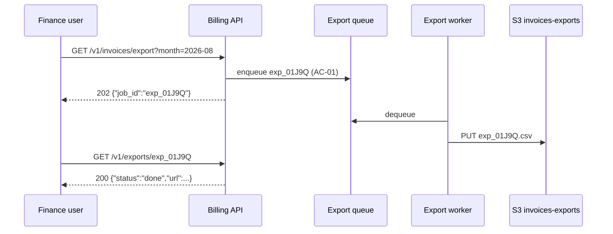

`/bdd-spec → gather context → acceptance cases first → BDD scenarios → diagrams → gaps, tech details, stages, DoD → lint → pragmatic review → deliver`

# bdd-spec — Self-contained BDD specification

You are producing **one Markdown file** that contains everything needed to build
and verify a feature, change, or system. Nobody should need a link, a meeting,
or a second document to act on it. The primary reader is a technical product
manager who must be able to say what will be built, why, in what order, and how
success is verified. The secondary readers are developers and coding agents who
implement and test straight from the text.

Files in this skill directory (the folder containing this SKILL.md; on a machine
that installed it, `~/.claude/skills/bdd-spec/` or `~/.codex/skills/bdd-spec/`):

- `templates/spec-template.md` — the skeleton with all 12 sections in order. Start from it.
- `scripts/check_spec.py` — lint that enforces the contract below. Run it before delivering.

## When to invoke

- Any request listed in the description above, or an `--update` of a spec this
  skill produced.
- You are about to hand a multi-part feature to developers or agents and there is
  no written contract for what "done" means.

Not for: one-line bug fixes, pure refactors with no product decision (an issue is
enough), or documenting an existing architecture (use `scrutinizer`).

## Arguments

`$ARGUMENTS` is interpreted as:

- Free text → the feature or topic to specify.
- A path → a brief, notes, issue export, or transcript to specify from. Read it fully.
- `--out <file.md>` → where to write. Default: `docs/specs/<slug>.md`, or the
  project's existing specs folder if one exists (`specs/`, `docs/specs/`,
  `docs/prd/`). Never overwrite an existing file unless `--update` names it.
- `--update <file.md>` → revise that spec in place (see "Updating an existing spec").

## The contract (non-negotiable)

1. **One file, self-contained.** No fact the reader needs may live only behind a
   link. If you must cite an external source, quote the relevant fact inline.
2. **Plain, simple English.** Short sentences. Cut filler. Keep every
   specification detail.
3. **Max 1000 lines.** Be information-dense. If over: cut prose, not cases; merge
   diagrams that show the same flow; keep one representative example per pattern.
   Budget about 20 lines per case plus about 200 for the fixed sections, so the
   ceiling is near 30 cases. Above about 25 cases, split by scope into sibling
   specs, each self-contained, with a one-line pointer in section 2. Never drop
   a case or strip its scenarios to fit.
4. **Visual beats description.** Any flow, interaction, structure, or state that
   can be drawn is drawn as **Mermaid source in a fenced block**, never an image,
   with a compact text explanation under it.
5. **Real examples are mandatory.** Actual payloads, config snippets, commands,
   log lines, error messages, and a short realistic user scenario. Show, then
   explain. Use realistic fake values; never real secrets, tokens, or personal data.
6. **Stable IDs.** `AC-01`, `AC-02`, … for acceptance cases; `OQ-01`, … for open
   questions; `AS-01`, … for assumptions; `DEP-01`, … for dependencies.
   Zero-padded, two digits minimum. Never renumber, never reuse. A dropped case
   keeps its section 4 row and its original priority tag, with
   `[DROPPED — reason, date]` appended to the case text; the lint then exempts
   it from sections 5, 10, and 11.
7. **Error, edge, and failure cases**, not only the happy path. Every case that
   touches I/O, a network, auth, concurrency, or user input gets at least one
   error scenario with the exact message or code the caller sees.
8. **Open questions are never deleted.** When resolved, the row stays, status
   becomes `resolved`, and the decision is written in the Decision cell with a date.
9. **Priorities map to stages.** `[MUST / P0]` = Stage 1 fast lane;
   `[SHOULD / P1]` = next stage(s); `[NICE TO HAVE / later]` = backlog. The stage
   table must agree with the tags exactly.
10. **Stage 1 is the smallest set of cases that delivers real, usable value end to
    end.** Not "set up infrastructure". Not a scaffold. Something a user can do.

## Required sections, in this order

Top-level headings must be `## N. Title` so the lint can find them.

| # | Heading | Must contain |
|---|---|---|
| 0 | Metadata | Version, date, status (`draft` / `approved`), author, change log table |
| 1 | Overview | Problem, who it affects, expected outcome once fully shipped, a short before/after scenario with a named user |
| 2 | Scope and non-goals | In-scope list; explicit out-of-scope list with the reason each is excluded |
| 3 | Assumptions, dependencies, open questions | Three short tables (`AS`, `DEP`, `OQ`); every row has ID, owner, status; OQ rows also have a Decision cell. Details live in the sections they affect and cite the ID, e.g. "Retention is 30 days (AS-02)" in section 9 |
| 4 | Acceptance cases | Table: ID, priority tag, one-line case. A PM reading only this table understands the full scope |
| 5 | BDD scenarios | Gherkin per AC, same ID and tag; happy path plus error and edge scenarios |
| 6 | Flow and sequence diagrams | Mermaid for every multi-step or multi-component case, AC IDs on or under each diagram, 2–5 lines of explanation |
| 7 | Current behavior and gaps | Table: AC, today, gap, evidence (`path:line`). Diagram if the current flow is non-obvious |
| 8 | Recommendation and ownership | Recommended approach; the main rejected alternative and the concrete reason; owner per part |
| 9 | Technical details and specifications | Interfaces, data formats, configuration, performance, constraints and limits, security, compatibility, logging and observability. Every item has a concrete example |
| 10 | Delivery stages | Table: stage, case IDs, what a user can do once it ships, rough effort. Stage 1 = all P0 cases, nothing else |
| 11 | Checklist with Definition of Done | One checkbox per AC: the test, command, expected output, or metric that proves it |

## Procedure

### 0. Gather context; do not invent

- Read the brief, notes, or `$ARGUMENTS`. Then read the repo: the code paths the
  feature touches, existing API definitions, config files, migrations, tests,
  and any prior specs or issues. Grep for the feature's nouns. Record real file
  paths, endpoint names, config keys, and error strings; they feed sections 7 and 9.
- Establish four facts: the end-user, the problem, the outcome, and what a user
  must be able to do for Stage 1 to count as "usable". If any is missing and the
  repo does not answer it, ask the user now, in one batched list. Anything still
  unknown after that becomes an `OQ-xx` with an owner. Do not stall on it.
- With `--update`: read the whole existing spec, keep every ID, append new IDs at
  the end of each sequence, bump the version, add a change log row.

### 1. Write the acceptance cases first (section 4)

- One observable capability per case: "<Actor> can <do X> [under condition] and
  gets <observable result>." Not an implementation task ("add index on
  `users.email`" belongs in section 9, not here).
- Tag each case. Then apply the fast-lane test: *if only the P0 cases ship, can a
  real user get the outcome end to end, however narrow?* If no, promote a case or
  cut the P0 cases' scope. If Stage 1 holds more than about five cases or cannot
  ship in one iteration, the fast lane is not fast; challenge it.
- For every case note which of these apply: I/O, external dependency, validation,
  auth, concurrency. Each applicable item needs an error or edge scenario in
  section 5 (empty, maximum, duplicate, concurrent, retry, timeout, denied).

### 2. Write the BDD scenarios (section 5)

- One `### AC-xx — <title> [tag]` heading per case, then a `gherkin` fenced block.
- Steps use concrete values: real-looking IDs, a real payload, an exact command.
  Never "valid input". `Then` is observable: status code, response body, UI
  state, file written, log line, metric.
- Error scenarios state the exact error message or code and what state must
  remain unchanged.
- Keep each scenario under about 12 lines. Use `Scenario Outline` with an
  `Examples` table for value matrices.

### 3. Draw before describing (section 6)

- Multi-component interaction → `sequenceDiagram`. Decisions and routing →
  `flowchart`. Lifecycle → `stateDiagram-v2`. Data relationships → `erDiagram`.
- Participants and nodes carry real component names (`Billing API`, `S3
  bucket invoices-prod`), not "service A". Put AC IDs in the diagram labels or in
  the heading above it. Explanation under each diagram: 2–5 lines.
- Mermaid hygiene: in `flowchart` and `graph` node labels, quote text containing
  `/`, `:`, `(`, or `"` as `A["POST /v1/jobs"]`; sequence messages need no
  quoting. First line is the diagram type; no HTML in labels; one diagram per
  fenced block.

### 4. Current behavior and gaps (section 7)

From the actual code, for each AC: what happens today, what is missing, and the
evidence as `path/to/file.ext:line`. If you cannot find out, write `unknown` and
open an `OQ`. Do not guess. If there is no system yet, write `no system today`
in the Today column and describe the manual workaround people use now; do not
open questions for it.

### 5. Recommendation, ownership, technical details (sections 8 and 9)

- One recommended approach, named by mechanism ("append-only export table
  polled by a worker", not "a robust export system"). One rejected alternative
  with the concrete reason: cost, risk, dependency, or timeline.
- Owners are names or roles the user gave. Unknown owner → `TBD (OQ-xx)`.
- Section 9, each with an example block:
  - Interface: endpoint, CLI, or function signature with a request and a response.
  - Data format: schema plus one sample record.
  - Configuration: key, default, example value, effect.
  - Performance: the target as a percentile under a stated load (`p95 < 300 ms
    at 50 req/s`) and how it is measured (dashboard, load-test command).
  - Constraints and limits: the number, and the exact behavior when exceeded.
  - Security: authn/authz, data handling, one denied-request example.
  - Compatibility: versions, migration, rollback, one command or config diff.
  - Logging and observability: exact log line format with a sample, metric names
    and types, alert thresholds.

### 6. Stages and Definition of Done (sections 10 and 11)

- Stage 1 = every P0 case and nothing else. Later stages group P1 cases by user
  value. Backlog = NICE TO HAVE. The "what a user can do" column is in user terms.
  Effort is S/M/L or person-days, marked as an estimate.
- One `- [ ] AC-xx — Verified by: …` line per case naming the test, command,
  expected output, exit code, or metric threshold. "Works correctly" is not a
  verification.

### 7. Lint, then read it as the PM would

```bash
python3 <this skill's directory>/scripts/check_spec.py docs/specs/<slug>.md
# installed copies: ~/.claude/skills/bdd-spec/scripts/check_spec.py
#                   ~/.codex/skills/bdd-spec/scripts/check_spec.py
```

It fails on: line limit, missing or misordered sections, an AC missing from
sections 5, 10, or 11, a bad or missing priority tag, Stage 1 not equal to the P0
set, section 3 rows without owner or status, undefined IDs, a missing Mermaid
block in section 6, an unknown Mermaid diagram type, unbalanced fences, images.
It warns on numbering gaps, cases with a single scenario or none titled
`error`, `edge`, or `failure`, resolved questions with no decision, and
non-checkbox DoD entries. Fix every failure. Read every warning
and fix it unless you can say why it is fine.

Then a manual pass:

- [ ] Reading sections 1, 4, and 10 alone, a PM knows what, why, in what order, and how success is measured.
- [ ] Every AC has at least one scenario; every AC touching I/O, validation, auth, or external systems has an error scenario.
- [ ] Every "the system will …" claim in section 9 sits next to an example.
- [ ] No sentence needs a link to be understood.
- [ ] Stage 1 delivers something a user can actually do.
- [ ] Diagrams show mechanism, not a bulleted list redrawn as boxes.

### 8. Stress-test with the `pragmatic` agent

Send the spec path to the `pragmatic` agent (Agent tool, `subagent_type:
"pragmatic"`) and ask it to challenge four things: whether Stage 1 is really the
smallest usable slice, which cases are speculative and belong in the backlog,
which non-functional requirements have no evidence behind them, and which open
questions actually block Stage 1. Apply what survives. If a challenge changes a
decision, record it in the change log. Skip this step only if the user said so.

### 9. Deliver

Write the file and report, in chat: the path, the line count, the case counts by
priority, the Stage 1 case list, and the open questions that need the user's
answer. Do not paste the whole spec into chat.

## Updating an existing spec

- Keep all IDs. New items get the next number in their sequence.
- A removed case keeps its section 4 row and its original tag, with
  `[DROPPED — reason, date]` appended to the case text. Its scenarios, stage
  entry, and DoD line may be removed; the section 4 row never is.
- Resolved open questions: status `resolved`, decision and date in the Decision cell.
- Retagging a case (P0 to P1, or back) is a minor bump. Update section 10 in the
  same edit and log it as `AC-04 P0 to P1`.
- Version bump: patch for wording, minor for new or changed cases, major for a
  scope change. Status flips back to `draft` whenever cases change, until re-approved.
- Add one change log row per revision.

## Worked excerpt

Feature: "Finance users can export invoices as CSV" in a SaaS billing app. Only
the parts that show the required precision are reproduced.

Section 4:

| ID | Priority | Case |
|---|---|---|
| AC-01 | [MUST / P0] | A finance user can export all invoices of one month as a CSV file and download it. |
| AC-02 | [SHOULD / P1] | A finance user can filter the export by customer and invoice status. |
| AC-03 | [NICE TO HAVE / later] | A finance user can schedule a monthly export delivered by email. |

Section 5:

```gherkin
Scenario: AC-01 happy path — month export
  Given account acc_7f3k has 1,240 invoices dated 2026-08
  And user fin.lee@acme.example has role "finance"
  When she requests GET /v1/invoices/export?month=2026-08
  Then the response is 202 with body {"job_id": "exp_01J9Q", "status": "queued"}
  And within 60 s GET /v1/exports/exp_01J9Q returns {"status": "done", "url": "https://files.example/exp_01J9Q.csv"}
  And the CSV has 1,240 data rows and the header "invoice_id,customer_id,issued_at,total_cents,currency,status"

Scenario: AC-01 edge — month with no invoices
  Given account acc_7f3k has no invoices dated 2019-01
  When she requests GET /v1/invoices/export?month=2019-01
  Then the response is 202 with body {"job_id": "exp_01J9R", "status": "queued"}
  And within 60 s the job is "done" and its CSV contains only the header row

Scenario: AC-01 error — wrong role
  Given user dev.kim@acme.example has role "developer"
  When he requests GET /v1/invoices/export?month=2026-08
  Then the response is 403 with body {"error": "forbidden", "message": "Role finance required"}
```

Section 6:



The export is asynchronous because a month can exceed the 30 s request timeout
(see section 9, limits). Polling is the P0 path; email delivery is AC-03.

Section 9, logging:

```text
2026-09-22T10:14:03Z level=info event=export.done job_id=exp_01J9Q account=acc_7f3k rows=1240 duration_ms=8412
```

Section 10:

| Stage | Cases | What a user can do once it ships | Effort |
|---|---|---|---|
| Stage 1 (fast lane) | AC-01 | Download a full month of invoices as CSV | M (est. 3 days) |
| Stage 2 | AC-02 | Narrow the export to one customer or status | S |
| Backlog | AC-03 | Receive the export by email every month | M |

Section 11:

- [ ] AC-01 — Verified by: `pytest tests/exports/test_month_export.py` → 3 passed; `curl -s -o /dev/null -w "%{http_code}" "$API/v1/invoices/export?month=2026-08"` → `202`.

## Anti-patterns

- "Handle errors gracefully" → name the error, the message, and what the user sees.
- A diagram that restates a bulleted list → keep one of the two.
- An acceptance case that is an implementation task → rewrite as observable behavior or move to section 9.
- Stage 1 = "set up the database and CI" → no user value; restructure.
