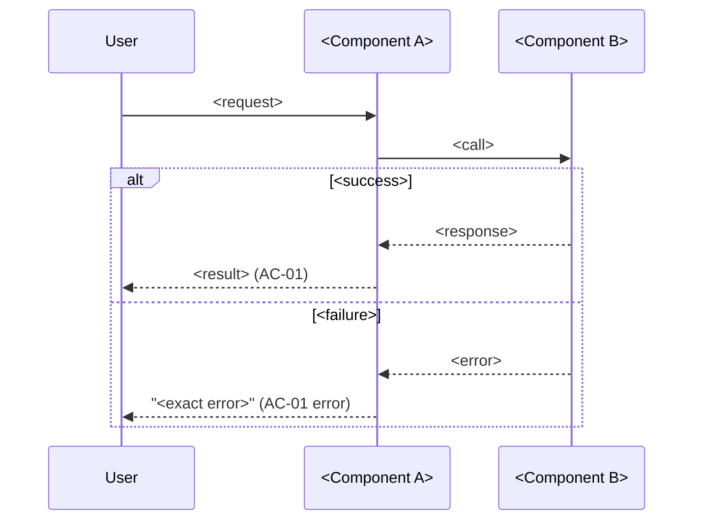

# <Feature name> — Specification

## 0. Metadata

| Field | Value |
|---|---|
| Version | 0.1.0 |
| Date | YYYY-MM-DD |
| Status | draft |
| Author | <name or role> |

Change log:

| Version | Date | Change |
|---|---|---|
| 0.1.0 | YYYY-MM-DD | Initial draft |

## 1. Overview

**Problem.** <What is broken or missing, for whom, and what it costs them today. One paragraph.>

**Who it affects.** <Roles, segments, or counts.>

**Expected outcome.** <What is true for the user once every stage has shipped.>

**Scenario, before and after.**
- Before: <Named user> does <steps>, hits <pain>, ends with <bad result>.
- After: <Named user> does <fewer steps>, gets <good result> in <time>.

## 2. Scope and non-goals

In scope:
- <Capability 1>
- <Capability 2>

Out of scope (explicit):
- <Thing readers will assume is included but is not, and why>

## 3. Assumptions, dependencies, open questions

Assumptions:

| ID | Assumption | Owner | Status |
|---|---|---|---|
| AS-01 | <Assumption stated as a checkable fact> | <owner> | unverified |

Dependencies:

| ID | Dependency | Owner | Status |
|---|---|---|---|
| DEP-01 | <External system, team, or library, with version> | <owner> | available |

Open questions:

| ID | Question | Owner | Status | Decision |
|---|---|---|---|---|
| OQ-01 | <Question that changes what gets built> | <owner> | open | — |
| OQ-02 | <Question already settled; keep the row> | <owner> | resolved | <Decision>, YYYY-MM-DD |

## 4. Acceptance cases

| ID | Priority | Case |
|---|---|---|
| AC-01 | [MUST / P0] | <Actor> can <action> and gets <observable result>. |
| AC-02 | [SHOULD / P1] | <Actor> can <action> under <condition> and gets <result>. |
| AC-03 | [NICE TO HAVE / later] | <Actor> can <action>. |

## 5. BDD scenarios

### AC-01 — <title> [MUST / P0]

```gherkin
Scenario: AC-01 happy path — <title>
  Given <concrete precondition with real values>
  When <concrete action>
  Then <observable result: status code, payload, UI state, file, log line>

Scenario: AC-01 error — <what goes wrong>
  Given <precondition>
  When <action that triggers the failure>
  Then the caller sees "<exact error message or code>"
  And <state that must remain unchanged>
```

### AC-02 — <title> [SHOULD / P1]

```gherkin
Scenario: AC-02 happy path — <title>
  Given <precondition>
  When <action>
  Then <result>

Scenario Outline: AC-02 edge — <boundary values>
  Given <precondition>
  When <action using "<value>">
  Then <result showing "<expected>">

  Examples:
    | value | expected |
    | <min> | <result> |
    | <max> | <result> |
```

### AC-03 — <title> [NICE TO HAVE / later]

```gherkin
Scenario: AC-03 happy path — <title>
  Given <precondition>
  When <action>
  Then <result>

Scenario: AC-03 edge — <condition>
  Given <precondition>
  When <action>
  Then <result>
```

## 6. Flow and sequence diagrams

### <Flow name> (AC-01, AC-02)



<Two to five lines: what the diagram shows and which branch maps to which case.>

## 7. Current behavior and gaps

| AC | Today | Gap | Evidence |
|---|---|---|---|
| AC-01 | <what the system does now> | <what is missing> | `path/to/file.ext:123` |
| AC-02 | <what the system does now> | <what is missing> | `path/to/file.ext:456` |
| AC-03 | not implemented | everything | — |

## 8. Recommendation and ownership

**Recommended approach.** <One paragraph. Name the mechanism, not the intention.>

**Rejected alternative.** <Alternative> — rejected because <concrete cost, risk, or dependency>.

| Part | Owner |
|---|---|
| <Component or workstream> | <name or role, or "TBD (OQ-xx)"> |

## 9. Technical details and specifications

### Interfaces

<Endpoint, CLI, or function signature.> Example:

```http
POST /v1/<resource>
Content-Type: application/json

{"<field>": "<value>"}
```

Response `201`:

```json
{"id": "<id>", "status": "<status>"}
```

### Data formats

<Schema plus one sample record.>

```json
{"<field>": "<value>", "<field2>": 0, "<field3>": ["<item>"]}
```

### Configuration

| Key | Default | Example | Effect |
|---|---|---|---|
| `<KEY>` | `<default>` | `<example>` | <what it changes> |

### Performance

| Operation | Target | Measured by |
|---|---|---|
| <endpoint or job> | p95 < <n> ms at <load> | <dashboard or load-test command> |

### Constraints and limits

| Limit | Value | When exceeded |
|---|---|---|
| <name> | <number + unit> | <exact error or behavior> |
| <retention or quota> | <value> (AS-01) | <exact error or behavior> |

### Security

<Authentication, authorization, data handling.> Denied request:

```http
GET /v1/<resource>
Authorization: Bearer <token lacking scope "<scope>">
```

Response `403`:

```json
{"error": "forbidden", "message": "<exact message>"}
```

### Compatibility

<Versions, migration, rollback.>

```bash
<migration command>   # forward
<rollback command>    # back, and what data it keeps
```

### Logging and observability

Log line format and one real example:

```text
<timestamp> level=<level> event=<event> id=<id> duration_ms=<n>
```

Metrics and alert thresholds:

| Metric | Type | Alert when |
|---|---|---|
| `<metric_name>` | counter / gauge / histogram | <condition> |

## 10. Delivery stages

| Stage | Cases | What a user can do once it ships | Effort |
|---|---|---|---|
| Stage 1 (fast lane) | AC-01 | <user-visible capability, end to end> | S |
| Stage 2 | AC-02 | <added capability> | M |
| Backlog | AC-03 | <added capability> | S |

## 11. Checklist with Definition of Done

- [ ] AC-01 — Verified by: `<test name or command>` → expected `<output, exit code, or metric>`.
- [ ] AC-02 — Verified by: `<test name or command>` → expected `<output, exit code, or metric>`.
- [ ] AC-03 — Verified by: `<test name or command>` → expected `<output, exit code, or metric>`.
